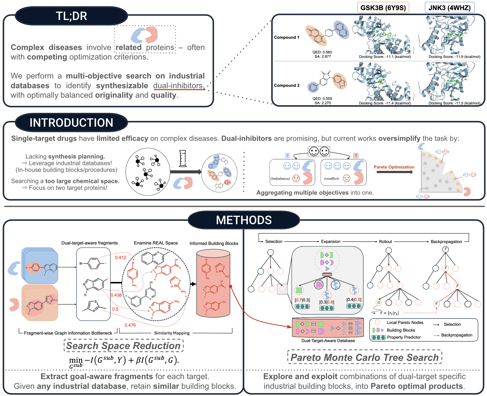

<h1 align="center">CombiMOTS: Combinatorial Multi-Objective Tree Search for Dual-Target Molecule Generation</h1>
<p align="center">
    <a href="https://openreview.net/forum?id=FSlTEObdLl"></a>
    <a href="https://icml.cc/media/PosterPDFs/ICML%202025/45885.png?t=1752232241.6172879"> </a>
    <a href="./assets/ICML2025-CombiMOTS_Slides.pdf"> </a>
</p>
Official implementation of CombiMOTS for Fragment-based Monte Carlo Tree Search for Dual-Inhibitors Molecular Graph Generation.

Refer to `Poster` or `Slides` for a more in-depth overview of our work!

<p align="center"></p>
<p align="center">Project overview.</p>

### Broader Applications

- We release a pretrained ensemble ChemProp ClinTox model in `models/clintox` that can be used for Toxicity Optimization as described in our original manuscript.
- We created another repository (<a href="https://github.com/Tibogoss/KinSel">  </a>) using CombiMOTS for the Selective Molecular Generation (using CDK7 as the target). Our main manuscript also discusses motivation background and implementation details.

# Baseline papers
Activity-aware fragments are obtained with Graph Information Bottleneck - Adapted from https://arxiv.org/abs/2310.00841

Our Pareto MCTS pipeline is adapted from **SyntheMol** https://www.nature.com/articles/s42256-024-00809-7

The 13 **Enamine** (https://enamine.net/) REAL Space and corresponding reactions are also provided by the work above.

To accelerate molecular docking simulation, we utilize **QuickVina-GPU-2.1** from https://pubmed.ncbi.nlm.nih.gov/39320991/


# Install Environment
Implementation was originally conducted with Python 3.10 and CUDA 11.7. The setup script creates the conda environment, installs Python dependencies with uv, and installs CombiMOTS editable from `combimots/.`.

```sh
bash setup_fresh_env.sh combimots
```

On HPC systems, load the CUDA/NVIDIA module before activating the environment:

```sh
conda deactivate
unset LD_LIBRARY_PATH OCL_ICD_VENDORS
module load CUDA/12.8.0  # or the CUDA module provided by your cluster
```

Activate CombiMOTS and expose the NVIDIA OpenCL ICD:

```sh
conda activate combimots
if [ -d /etc/OpenCL/vendors ]; then export OCL_ICD_VENDORS=/etc/OpenCL/vendors; fi
export LD_LIBRARY_PATH=${LD_LIBRARY_PATH:+$LD_LIBRARY_PATH:}$CONDA_PREFIX/lib
```

QED/SA objectives require PyTDC, which is optional by default. Install it only when running `pmcts --qed_sa`, `pmcts --all_objectives`, or `combimots/postprocess/10-evaluate.py`:

```sh
uv pip install --python "$CONDA_PREFIX/bin/python" pytdc
```

## Docking Setup

Clone/configure QuickVina-GPU, compile it, and validate the docking setup:

```sh
python setup_docking.py --compile-source
pmcts-validate-docking --target-pair gsk3b_jnk3
```

`setup_docking.py` writes `COMBIMOTS_DOCKING_PATH` to `.env`, replacing the legacy hardcoded `DOCKING_PATH_PREFIX`. If local Boost/OpenCL paths are non-standard, pass `--boost-lib-path` or `--opencl-lib-path`, or run `make source` manually inside `combimots/pmcts/docking/Vina-GPU-2.1/QuickVina2-GPU-2.1`.

Check OpenCL before running docking-heavy steps:

```sh
clinfo -l
```

# Pipeline

In `/data` you may place a .csv file containing:
- smiles
- {target1}_activity
- {target2}_activity

For demonstration, we provide data for the GSK3B-JNK3, EGFR-MET and PIK3CA-mTOR target pairs.

This data is curated from **ExCAPE-DB v2** (https://jcheminf.biomedcentral.com/articles/10.1186/s13321-017-0203-5)

# Note to the user
The next section describes pre-processing steps.

If you only want to run generation and evaluation, **we provide processed data and model checkpoints**.
You may skip these steps and directly go to the generation section.

The numbered preprocessing compatibility wrappers live in `combimots/utils_preprocess/`, and post-generation utilities live in `combimots/postprocess/`.

## Train Chemprop Checkpoints

The preprocessing runner uses existing Chemprop checkpoints from `models/{model_name}` when predicting building-block bioactivity. Train them once before running preprocessing if you are not using the provided checkpoints:

```sh
chemprop_train --data_path data/GSK3B_JNK3.csv \
  --dataset_type classification \
  --split_type cv \
  --num_folds 10 \
  --seed 42 \
  --gpu 0 \
  --save_dir models/gsk3b_jnk3
```

## Pre-processing

Pre-processing includes (in order):
- FGIB dataset preparation and model training for both targets;
- Fragment extraction, cleaning, and merging for both targets;
- Similarity mapping from fragments to Enamine REAL building blocks, default Tanimoto threshold `0.4`;
- Salt stripping/canonicalization with `chemfunc` before reaction mapping;
- Empty, invalid, disconnected, and duplicate canonical SMILES cleanup;
- B, Si, and Li filtering for QuickVina compatibility;
- Building-block bioactivity prediction with Chemprop checkpoints;
- Building-block docking score precomputation with QuickVina-GPU;
- REAL search-space mapping and reaction-template filtering.

The preprocessing runner can run the full sequence:


```sh
combimots-preprocess \
  --target-pair gsk3b_jnk3 \
  --input-csv data/GSK3B_JNK3.csv
```

Alternatively, run a step range with:

```sh
combimots-preprocess --target-pair gsk3b_jnk3 --input-csv data/GSK3B_JNK3.csv --from-step similar-blocks --to-step filter-reactions --resume
```

Per-step reports are written under `models/{model_name}/preprocess_reports/` with ordered filenames such as `00-fgib-data.json`, `05-canonicalize-smiles.json`, and `10-filter-reactions.json`.

The filtered REAL mapping is written to `combimots/pmcts/resources/real/{target_pair}.pkl` with schema `reaction_id -> reactant_position -> set[SMILES]`. 

**IMPORTANT!** Empty reduced reaction positions fall back to the packaged REAL mapping and are reported in the step JSON. In practice, if the reduced space leads to an empty position for a given reaction, the final space will contain ALL native blocks for this position.


# Generation: Pareto Monte-Carlo Tree Search


```sh
pmcts \
  --model_path models/gsk3b_jnk3 \
  --save_dir generations/gsk3b_jnk3/ \
  --target_activities gsk3b_activity jnk3_activity \
  --target_pair gsk3b_jnk3 \
  --building_blocks_path models/gsk3b_jnk3/final_blocks.csv \
  --n_rollout 5000
```

## Evaluation

Filter out the molecules predicted as dual actives
```sh
python combimots/postprocess/9-filter_dual_actives.py generations/${model_name}/pareto_molecules.csv generations/${model_name}/pareto_dual_actives.csv

# $ python combimots/postprocess/9-filter_dual_actives.py generations/gsk3b_jnk3/pareto_molecules.csv generations/gsk3b_jnk3/pareto_dual_actives.csv
```
Optionally, re-docking simulations have to be run separately.

For all other metrics (Validity, Uniqueness, Novelty, Diversity, Avg.QED, Avg.SA), we provide `combimots/postprocess/10-evaluate.py`:
```sh
python combimots/postprocess/10-evaluate.py --model ${model_name} \
--generation generations/${model_name}/pareto_dual_actives.csv \
--training {path_to_dual_positives_of_training_set_csv}

# $ python combimots/postprocess/10-evaluate.py --model gsk3b_jnk3 --generation generations/gsk3b_jnk3/pareto_dual_actives.csv --training data/GSK3B_dual_actives.csv
```

If you find our paper/repo useful or use it for personal projects/research, please cite our original paper: -->

```bibtex -->
@inproceedings{
southiratn2025combimots,
title={Combi{MOTS}: Combinatorial Multi-Objective Tree Search for Dual-Target Molecule Generation},
author={Thibaud Southiratn and Bonil Koo and Yijingxiu Lu and Sun Kim},
booktitle={Forty-second International Conference on Machine Learning},
year={2025},
url={https://openreview.net/forum?id=FSlTEObdLl}
}
```
